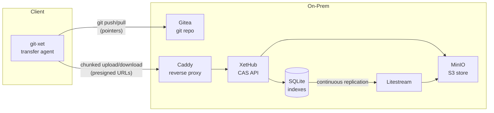

# XetHub

A self-hosted [Xet Protocol](https://huggingface.co/docs/xet/en/index)-compatible Content Addressable Storage (CAS) server, designed for storing and versioning large ML models with chunk-level deduplication. Built on [OpenXet](https://github.com/ggoggam/openxet) with added SQLite indexes, presigned URL downloads, and a Docker Compose deployment stack backed by MinIO.

## Why

Pushing a 140GB model to git takes forever. Fine-tuning changes ~5% of weights, but without dedup you re-upload the entire thing. XetHub breaks files into content-defined chunks — only changed chunks get uploaded. A 5% tweak to a 70B model uploads ~7GB instead of 140GB.

This repo is the self-hosted version: runs on your own hardware, backed by MinIO (S3-compatible), with SQLite indexes replicated via Litestream for disaster recovery. Pairs with an existing Gitea instance — Gitea stores git history, XetHub stores the large file data.

## Quick Start

```bash
# Prerequisites: Rust, Docker, just, mise
mise install

# See available commands
just

# Deploy the full stack (MinIO + XetHub + Litestream + Caddy)
just up

# Run tests (includes 200MB dedup benchmark)
just test

# Generate an auth token
just token
```

### Using with git-xet

```bash
# Point git-xet at your server
export HF_XET_DATA_DEFAULT_CAS_ENDPOINT=http://your-xethub-host:8080

# One-time setup
git xet install
git xet track "*.safetensors" "*.bin" "*.pt"

# Normal git workflow — xet handles large file chunking transparently
git add .
git commit -m "fine-tuned model v2"
git push  # only changed chunks are uploaded
```

## Architecture



- **Gitea** — stores git history, `.gitattributes`, LFS pointer files
- **XetHub** — CAS server with SQLite-backed file/chunk/xorb indexes
- **MinIO** — S3-compatible object storage for xorbs and shards
- **Litestream** — continuous SQLite replication to MinIO for DR
- **Caddy** — reverse proxy (optional HTTPS)
- **git-xet** — LFS custom transfer agent, handles CDC chunking transparently

### Crate Structure

```
crates/
├── hashing/       # MerkleHash, Blake3 keyed hashing, aggregated merkle tree
├── chunking/      # Gearhash content-defined chunking (CDC)
├── cas_types/     # Xorb/Shard binary formats, chunk compression
└── server/        # HTTP server (axum) with auth, storage, indexes, routes
```

### Self-Hosted Stack (Docker Compose)

```bash
just up
# Starts: MinIO (:9000) + XetHub (:8080) + Litestream + Caddy (:80)
```

Defined in `docker/compose.selfhost.yaml`. Configuration via environment variables:

| Variable | Default | Description |
|----------|---------|-------------|
| `OPENXET_AUTH_SECRET` | `change-me-in-production` | JWT signing secret |
| `OPENXET_INDEX_BACKEND` | `sqlite` | Index backend (`sqlite` or `filesystem`) |
| `OPENXET_EXTERNAL_S3_URL` | `http://localhost:9000` | Public MinIO URL for presigned downloads |
| `OPENXET_PRESIGNED_URL_EXPIRY` | `3600` | Presigned URL TTL in seconds |
| `MINIO_ROOT_USER` | `minioadmin` | MinIO credentials |
| `MINIO_ROOT_PASSWORD` | `minioadmin` | MinIO credentials |

### Dedup Performance

From the benchmark test (`cargo test --test dedup_benchmark -- --nocapture`):

```
═══ DEDUP SAVINGS ═══
  Original:       200 MB uploaded
  Tweaked (naive): 200 MB would be uploaded
  Tweaked (dedup): 60 MB actually uploaded
  Savings:        70%
  Speedup:        3.3x
```

At scale (140GB model, ~2300 xorbs), a 5% localized change reuses ~95% of xorbs → **~20x speedup**.

## API

### CAS Protocol

| Method | Path | Description |
|--------|------|-------------|
| `GET` | `/v1/reconstructions/{file_id}` | File reconstruction (supports Range header, presigned URLs) |
| `GET` | `/v1/chunks/default-merkledb/{hash}` | Global chunk deduplication query |
| `GET` | `/v1/xorbs/default/{hash}` | Download a xorb |
| `POST` | `/v1/xorbs/default/{hash}` | Upload a serialized xorb |
| `POST` | `/v1/shards` | Upload shard metadata (registers files) |

### Management

| Method | Path | Description |
|--------|------|-------------|
| `GET` | `/api/stats` | Storage statistics |
| `GET` | `/api/files` | List stored files |
| `GET` | `/api/files/{hash}/content` | Download reconstructed file |
| `POST` | `/api/upload` | Single-shot file upload |

### CLI Subcommands

```bash
openxet-server serve              # Run the server (default)
openxet-server generate-token     # Generate a JWT auth token
openxet-server rebuild-index      # Rebuild SQLite indexes from stored shards
```

## Development

```bash
just test      # All tests (76 tests including integration + dedup benchmark)
just fmt       # Format
just lint      # Clippy
just check     # fmt + lint + test
```

### Disaster Recovery

SQLite indexes are continuously replicated to MinIO via Litestream. To restore:

```bash
litestream restore -o /data/index.db s3://litestream/index.db
# Or: openxet-server rebuild-index (slower, scans all shards)
```

## License

[Apache License 2.0](https://www.apache.org/licenses/LICENSE-2.0)

## Acknowledgments

Based on [OpenXet](https://github.com/ggoggam/openxet) by ggoggam. Protocol spec: [Xet Protocol v1.0.0](https://huggingface.co/docs/xet/en/index).
